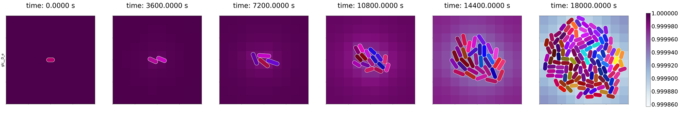

# Vivarium

Vivarium is a multiscale platform for simulating cells in dynamic
environments, within which they can grow, divide, and thrive.

## Documentation and Tutorials
Visit [Vivarium documentation](https://wc-vivarium.readthedocs.io/)

## Concept

A Vivarium is a "place of life" -- an enclosure for raising organisms in controlled environments for observation or 
research. Typical vivaria include aquariums or terrariums.  The vivarium provided in this repository is a computational 
vivarium for developing colonies of whole-cell model agents in dynamic environments. Its framework is a synthesis of 
whole-cell modeling, agent-based modeling, multi-scale modeling, and modular programming.

Vivarium is a framework for composing hybrid models of different cellular/molecular processes into compartments, and 
compartments into embedded hierarchies. Vivarium is distributed in that processes can run in 
different threads or on different computers, and upon hierarchy changes such as division, new threads are allocated. 
Processes communicate through message passing and are coordinated by the environmental simulation which receives all 
of the messages, integrates them, and responds to each processes with their new states. 
