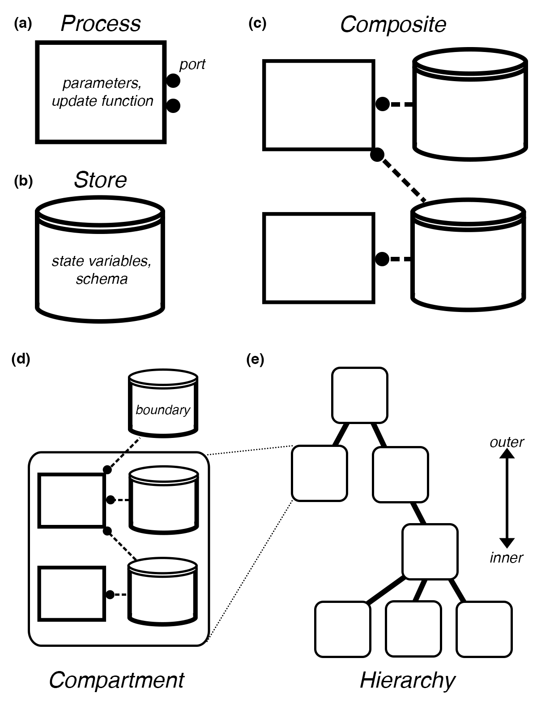

# Vivarium-core

Vivarium-core provides a process interface and simulation engine for composing and executing integrative multi-scale models.

## Documentation and Tutorials
Visit [Vivarium documentation](https://vivarium-core.readthedocs.io/).

## Installation
vivarium-core can be used as a python library. To install:
```
$ pip install vivarium-core
```

## Concept
Vivarium addresses computational biology's dual challenges of model reuse and multi-scale integration by explicitly 
separating the interface that connects models from the frameworks that implement them.
The modular "process" interface allows different models to be assembled within a hierarchy of embedded compartments, 
and then run by the engine as integrated, multi-scale simulations.



(**a**) *Processes* define the functions that update the system's state variables.They declare *parameters*, *ports*, and an *update function*.
(**b**) *Stores* hold the state variables and map each process' variable *names* to their *values*.
They have a schema that determines how the variables are handled with properties such as *units*, *updaters*, *dividers*, *emitters*, and more. 
(**c**) *Topology* is a bipartite graph of processes connected to stores through their ports. 
Shared stores aggregate the processes' required variables, and couple the processes as they unfold in time. 
(**d**) Processes and Stores can be linked together with a topology in a single level called a compartment, and across compartments by way of boundary stores.
(**e**) Compartments are embedded within each other in a hierarchy -- depicted here as a place graph with outer compartments at the top and inner compartments below them.
