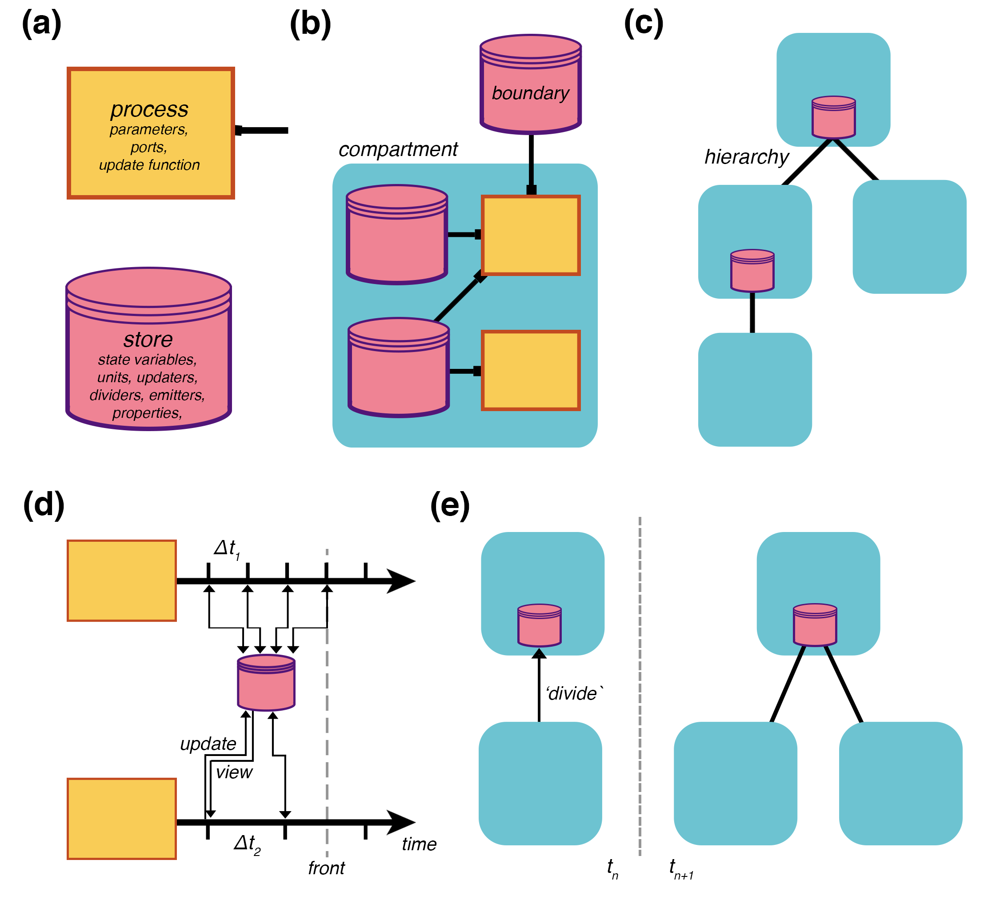

# Vivarium-core

Vivarium-core provides a process interface and simulation engine for composing and executing multi-scale 
computational biology models.

## Documentation and Tutorials
Visit [Vivarium documentation](https://vivarium-core.readthedocs.io/)

## Installation
vivarium-core can be used as a python library. To install:
```
$ pip install vivarium-core
```

## Concept
Vivarium addresses computational biology's dual challenges of model reuse and multi-scale integration by explicitly 
separating the interface that connects models from the frameworks that implement them.
The modular "process" interface allows different models to be assembled within a hierarchy of embedded compartments, 
and then run by the engine as integrated, multi-scale simulations.


(**a**) Processes and stores are the framework's basic elements. Processes declare *parameters*, *ports* that 
connect to stores, and an *update function* that computes how the state variables unfold over time. 
Stores hold the variables' states and determine how process updates are handled with *units*, *updaters*, *dividers*, 
*emitters*, properties such as *molecular weight*, and more. 
(**b**) A *compartment* is a composite of processes created with a bipartite graph called a topology, which declares how 
processes connect to stores through their ports. 
Boundary stores reach outside of the compartment, allowing it to connect with other compartments above or below. 
(**c**) A *hierarchy* of embedded compartments is a place graph with the higher compartments containing those below. 
(**d**) Two coupled processes operating at different time scales, showing their separated updates of a shared store, and 
an advancing temporal *front*.
(**e**) A topology update shows the addition of a compartment in the time-step after a division update message is 
sent---other topology updates might include merging, engulfing, deleting, or adding.
