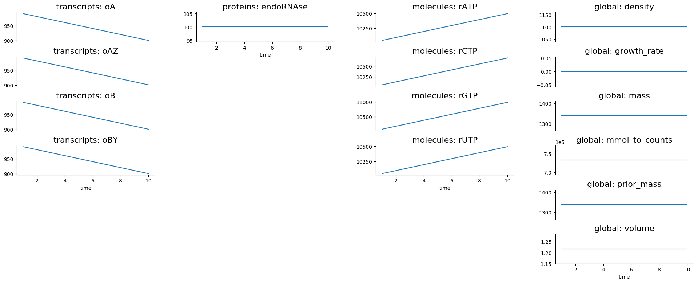
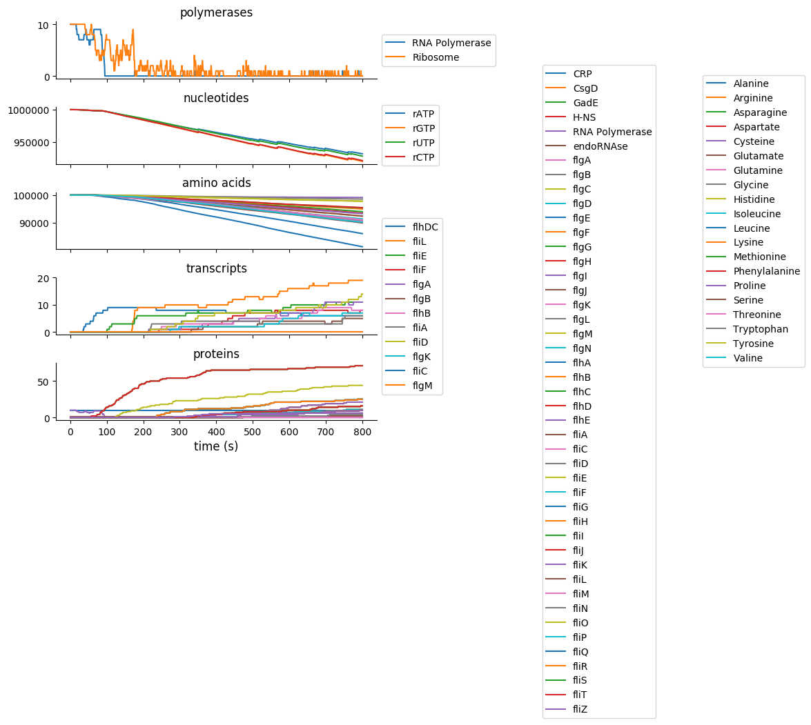
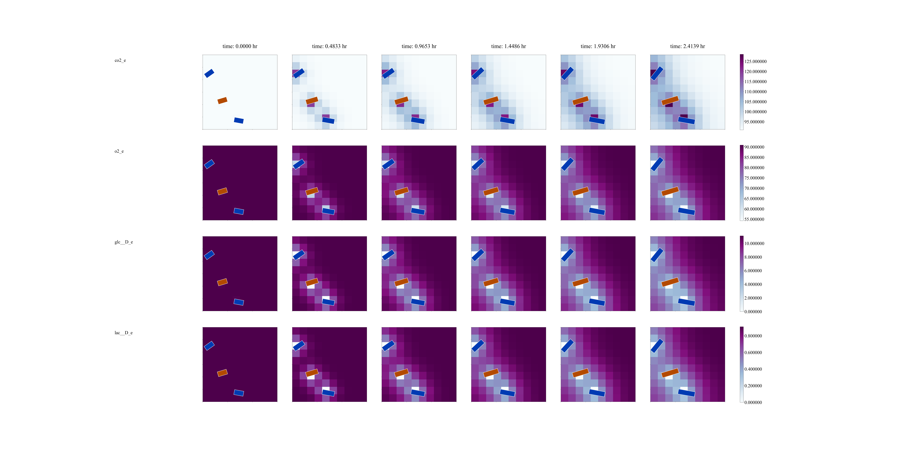
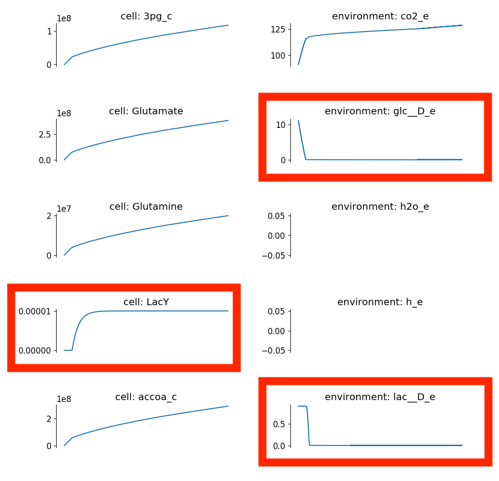
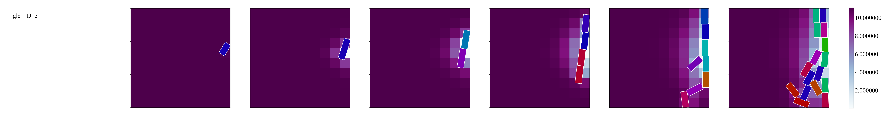

===============
Getting Started
===============

-------------------------
Download and Installation
-------------------------

This guide assumes that you have access to an administrator or sudoer
account on a macOS or Linux system.

Getting Organized
=================

Creating Enclosing Directory
----------------------------

Create a ``vivarium_work`` folder anywhere you like. But for installing
some third-party software, everything we do will occur inside this
folder.

.. _pypath:

Setting PYTHONPATH
------------------

Vivarium needs the root of the repository to be in your ``PYTHONPATH``
environment variable so that Python can find Vivarium. To make this easy
to set, we suggest adding this line to your shell startup file:

.. code-block:: bash

    alias pycd='export PYTHONPATH="$PWD:$PYTHONPATH"'

Now when you are about to work on Vivarium, navigate to the root of the
Vivarium repository (``vivarium_work/vivarium``) and run ``pycd`` in
your terminal. You will need to do this for each terminal window you
use.

Installing Dependencies
=======================

Below, we list the dependencies Vivarium requires, how to check whether
you have them, how to install them, and in some cases, how to set them
up for Vivarium.  Make sure you have each of them installed.

Python 3
--------

We wrote Vivarium in Python 3. While we did also write it to be
Python-2-compatible, `the Python Software Foundation has deprecated
Python 2 <https://www.python.org/dev/peps/pep-0373/>`_, so we strongly
recommend using Python 3.

*Check Installation*

.. code-block:: console

    $ python --version
    Python <version>

Make sure you see a version at least 3.6.

*Install*

Download the latest installer from the `Python download page
<https://www.python.org/downloads/>`_

Open JDK 8
----------

Zookeeper and Kafka, which we will address later, require that you have
Java installed.

*Check Installation*

.. code-block:: console

    $ java -version
    java version <version> <date>

Ensure the version is at least 1.8.

*Install*

Download the latest JDK installer from the `Java SE Downloads site
<https://www.oracle.com/java/technologies/javase-downloads.html>`_.  As of
writing the latest is Java SE 14. Download and run the appropriate
installer for your platform. Then you need to set the ``JAVA_HOME``
environment variable, for instance by adding ``export
JAVA_HOME=$(/usr/libexec/java_home)`` to your startup shell file (e.g.
``~/.bash_profile`` or ``~/.profile``).

Zookeeper and Kafka
-------------------

Kafka is a message passing system that allows decoupling of message
senders and message receivers. It does this by providing two
abstractions, a Consumer and a Producer. A Consumer can subscribe to any
number of "topics" it will receive messages on, and a Producer can send
to any topics it wishes. Topics are communication "channels" between
processes that otherwise do not need to know who is sending and
receiving these messages. Vivarium uses Kafka to pass messages between
actors, for example between a cell and its environment.

Kafka relies on Zookeeper, which synchronizes access to a hierarchy of
key-value pairs called nodes. We like Kafka because it will let us
distribute the model across computers in a server cluster, but you can
also run a local Kafka instance for development.

*Check Installation*

For this guide, we will not install Kafka globally on your system.
Instead, we will store the Kafka program in ``vivarium_work`` and run
the executable directly. This means you almost certainly need to install
it, even if you use Kafka already.

*Install*

#. Download Kafka from the `Apache Kafka site
   <https://kafka.apache.org/downloads>`_, choosing the latest version.
   This will give you a ``.tgz`` archive file that includes both Kafka
   and Zookeeper.
#. Unarchive this file into ``vivarium_work`` to create a folder like
   ``vivarium_work/kafka_2.11-2.0.0/``. Your folder name will likely
   change slightly to match your version of Kafka.
#. Create a shell script ``vivarium_work/zookeeper.sh`` with the
   following content:

   .. code-block:: bash

        #!/bin/bash

        ./kafka_2.11-2.0.0/bin/zookeeper-server-start.sh \
            ./kafka_2.11-2.0.0/config/zookeeper.properties

#. Create a shell script ``vivarium_work/kafka.sh`` with the following
   content:

   .. code-block:: bash

        #!/bin/bash

        ./kafka_2.11-2.0.0/bin/kafka-server-start.sh \
            ./kafka_2.11-2.0.0/config/server.properties \
            --override listeners=PLAINTEXT://127.0.0.1:9092

   Overriding the "listeners" address like this allows connections to
   the Kafka server to withstand network DHCP address changes and the
   like.
#. Make the scripts executable like this:

   .. code-block:: console

        $ chmod 700 vivarium_work/kafka.sh
        $ chmod 700 vivarium_work/zookeeper.sh

   Now you can start and stop the Zookeeper and Kafka servers like this:

   .. code-block:: console

        $ vivarium_work/zookeeper.sh
        $ vivarium_work/kafka.sh

   Make sure to start Zookeeper before Kafka, as Kafka expects a
   Zookeeper instance to already be running when in starts. Also note
   that you must run these two commands in separate terminals. To shut
   them down, you can just use CTRL-C to kill the processes.

   .. WARNING:: Make sure you shut down Kafka before Zookeeper!  If you
       shut down Zookeeper first, Kafka will refuse to quit. You can
       then force it to stop with ``kill -9``.

MongoDB
-------

We use a MongoDB database to store the data collected from running
simulations. This can be a remote server, but for this guide we will
run a MongoDB server locally.

*Check Installation*

.. code-block:: console

    $ mongod --version
    db version v4.2.3
    ...

Make sure you see a version at least 4.2.

*Install*

If you are on macOS, you can install MongoDB using `Homebrew
<https://brew.sh>`_. You will need to add the MongoDB tap following the
instructions `here <https://github.com/mongodb/homebrew-brew>`_.

If you are on Linux, see the MongoDB documentation's `instructions
<https://docs.mongodb.com/manual/administration/install-on-linux/>`_.

*Setup*

You can get a MongoDB server up and running locally any number of ways.
Here is one:

#. Create a folder ``vivarium_work/mongodb``. This is where MongoDB will
   store the database We store the database here instead of at the
   default location in ``/usr/local/var/mongodb`` to avoid permissions
   issues if you are not running as an administrator.
#. Make a copy of the ``mongod`` configuration file so we can make
   changes:

   .. code-block:: console

      $ cp /usr/local/etc/mongod.conf vivarium_work/mongod.conf

   Note that your configuration file may be somewhere slightly
   different. Check the MongoDB documentation for your system.
#. In ``vivarium_work/mongod.conf`` change the path after ``dbPath:`` to
   point to ``vivarium_work/mongodb``.
#. Create a shell script ``vivarium_work/mongo.sh`` with the following
   content:

   .. code-block:: bash

      #!/bin/bash

      mongod --config mongodb.conf

#. Make the script executable:

   .. code-block:: console

        $ chmod 700 vivarium_work/mongo.sh

   Now you can launch MongoDB by running this script:

   .. code-block:: console

        $ vivarium_work/mongo.sh

.. todo:: Use ``py -m agent.boot --host ip.to.remote.cluster:9092``
    for remote Kafka services

GNU Linear Programming Kit (GLPK)
---------------------------------

.. todo:: What is GLPK used for?

One of the Python packages we will install later, ``swiglpk``, requires
that you already have GLPK installed on your system.

*Check Installation*

We don't have a way to check whether you have ``glpk`` installed. If you
think you already have it, you can proceed with the installation and
watch for an error about missing ``glpk``.

.. todo:: Check GLPK installation

*Install*

If you use Homebrew, you
can install GLPK like this:

.. code-block:: console

    $ brew install glpk

Otherwise, follow the installation instructions on the GLPK
`homepage <https://www.gnu.org/software/glpk>`_.

Leiningen
---------

Our simulation runs each cell on its own thread, and we use Leiningen
to manage these threads.

*Check Installation*

To check whether you have Leiningen installed, run:

.. code-block:: console

    $ lein --version
    Leiningen <version> ...

You may also see a deprecation warning from Java HotSpot, which you can
ignore. Make sure the version is at least 2.9.

*Install*

To install Leiningen, follow the instructions on its `website
<https://leiningen.org/>`_. You can also install the ``leiningen``
formula on Homebrew instead.

Download and Setup Vivarium
===========================

Download the Code
-----------------

The Vivarium code is available on `GitHub
<https://github.com/CovertLab/vivarium>`_. Move into your
``vivarium_work`` directory and clone the repository to
download the code

.. code-block:: console

    $ cd vivarium_work
    $ git clone https://github.com/CovertLab/vivarium.git

This will create a ``vivarium`` folder inside ``vivarium_work``. All the
code for Vivarium is inside this ``vivarium`` folder.

Installing Python Packages
--------------------------

Above we installed all the non-Python dependencies, but we still have to
install the Python packages Vivarium uses.

#. Move into the ``vivarium`` folder created when you cloned the
   repository.
#. (optional) Create and activate a virtual environment:

   .. code-block:: console

      $ python3 -m venv venv
      ...
      $ source venv/bin/activate

#. Install Numpy. One of our dependencies, ``stochastic-arrow`` requires
   that Numpy be installed first. Check the ``requirements.txt`` file
   for a line like this:

   .. code-block::

        numpy==1.15.3

   Now install the version of Numpy specified in ``requirements.txt``

   .. code-block:: console

        $ pip install numpy==1.15.3

#. Install packages

   .. code-block:: console

        $ pip install -r requirements.txt

   If you encounter problems installing numpy and/or scipy, try this
   instead:

   .. code-block:: console

        $ pip install -r requirements.txt --no-binary numpy,scipy
        $ pip install numpy
        $ pip install scipy

Now you are all set to run Vivarium!

---------------
Run Simulations
---------------

Some Terminology: Processes and Composites
==========================================

In Vivarium, we break our cell models into :term:`processes`. Each process
models part of the cell's function. For example, we have processes for
metabolism, transcription, and translation in Vivarium. We can combine
these processes into :term:`compartments` that model a cell with all the
functionality modeled by the included processes. For example, we could
compose transcription and translation to create a fuller gene
expression model.

In Vivarium, we store individual processes in
``vivarium/vivarium/processes`` and compartments of processes in
``vivarium/vivarium/compartments``.

Running Processes and Composites in Isolation
=============================================

You can run any process or compartment by itself. While this is too simple
for modeling whole cells or colonies, simulating processes in isolation
lets you study their dynamics and tune them to different conditions. To
run a process or compartment, you can execute the Python file that defines
it. For example, we can run the degradation process like this:

.. code-block:: console

    $ python vivarium_work/vivarium/vivarium/processes/degradation.py
    ...

.. tip:: If you get errors from Python about being unable to find
   ``vivarium``, make sure you've added the repository root to your
   PYTHONPATH. See :ref:`pypath` for details.

Don't worry about the output--it's for developers. You will see a new
folder at ``vivarium_work/vivarium/vivarium/out/tests``. This is where
we store the output from running processes and compartments in isolation.
For the degradation process, the output is in the ``degradation`` folder
inside ``tests``. Here you'll find a ``simulation.png`` file that looks
like this:

        the y-axis and time on the x-axis. In the first column, we see
        the concentration of transcripts decreasing linearly with time,
        while in the third column concentrations of the four RNA
        nucleotides increase linearly with time. In the second column a
        plot of the concentration of endoRNAse is a horizontal line, and
        in the fourth column plots of metrics like density, volume, and
        mass are all constant.

If you wanted to understand how the degradation process works, this
would show you that it removes transcripts and returns the RNA
nucleotides to the cell.

Some processes also produce the data shown in the plots.  You can find
this data in ``simulation_data.csv``. Try running the
``convenience_kinetics`` process to see how this works!

Lastly, try running the ``flagella_expression`` compartment like this:

.. code-block:: console

    $ python vivarium_work/vivarium/vivarium/compartments/flagella_expression.py

Now in the ``flagella_expression_composite`` (the suffix ``_composite``
is left over from when we called compartments "composites") in
``tests``, you should see an image containing a plot like this:

        nucleotides, amino acids, transcripts, and proteins over time.
        The amino acid plot shows one amino acid running out first.

Notice that even from this minimal simulation, we can tell which amino
acid is limiting! In this case the colors are so similar that it's hard
to tell, but the limiting amino acid is either alanine or leucine.

.. todo:: Is alanine or leucine limiting?

.. _agents-in-terminal-windows:

Running Agents in Terminal Windows
==================================

.. tip:: Running agents separately in terminal windows is helpful
    for debugging because it lets you see the output from each agent.

Terminology: Agents
-------------------

Vivarium is heavily influenced by agent-based modeling, in which the
model consists of individual agents interacting with each other. In
Vivarium, cells are agents that move around and grow within a shared
environment. These agents interact with each other and their environment
by passing messages through Kafka.

.. todo:: Link to more comprehensive topical guide

.. _getting-started-how-to-run-agents:

How to Run Agents
-----------------

Each agent runs on its own thread. We do this because each agent can be
as complex as an entire whole-cell model, so the entire simulation
cannot run on a single thread. Shepherd can manage these threads for
you; importantly, you must use Shepherd if your simulation will require
creating or deleting threads. Cell division, for example, involves
stopping the mother cell's thread and starting two new threads, one for
each daughter cell, so division requires Shepherd.

.. todo:: Link to using Shepherd

That said, you *can* run agents on your own instead of using Shepherd.

.. WARNING:: If you run a simulation using this method that includes
    stopping and/or starting agents, the agents will stop, but new ones
    will not start. For example if your cell divides, the agent you
    started for the mother cell will stop, but the daughter cells will
    not start.

We will run each agent in its own terminal window to mimic the threads
that Shepherd would create. Let's see how!

First we need to get all our servers running. Do each of the following
in a separate terminal window:

#. Start Zookeeper:

   .. code-block:: console

        $ vivarium_work/zookeeper.sh
        ...
        ... INFO binding to port 0.0.0.0/0.0.0.0:2181 ...

#. Start Kafka:

   .. code-block:: console

        $ vivarium_work/kafka.sh
        ...
        ... INFO [KafkaServer id=0] started (kafka.server.KafkaServer)

   You should also see som text print out on the Zookeeper window. You
   might see some ``NoNode`` warnings--these are safe to ignore.

   .. WARNING:: You must start Zookeeper before Kafka!

#. Start MongoDB:

   .. code-block:: console

        $ vivarium_work/mongo.sh

   There shouldn't be any output.

   If you installed MongoDB using Homebrew, you can instead
   tell Homebrew to always run a MongoDB server by running:

   .. code-block:: console

        $ brew services start mongodb/brew/mongodb-community

   Now a MongoDB server will start automatically once you login.
   Then you can skip the step of starting MongoDB in the future.

Now we can create our agents. We create an agent like this:

.. code-block:: console

    $ python -m vivarium.environment.boot --type <type> --id <id> [--outer-id <outId>]

.. tip:: If you get errors from Python about being unable to find
   ``vivarium``, make sure you've added the repository root to your
   PYTHONPATH. See :ref:`pypath` for details.

where ``<type>`` is the agent type, ``<id>`` is the identifier for this
agent, and ``<outId>`` is an optional argument that instructs Vivarium
to place the new agent inside the agent with identifier ``<outId>``.
This outer agent will almost always be an environment. You can also
provide an optional ``--config '{...}'`` argument you can use to
configure the agent.

.. todo:: Link to information on configuration

To see the other agent types, check out the help text like this:

.. code-block:: console

    $ python -m vivarium.environment.boot --help

.. todo:: Point to the autogenerated docs for the agents

Here's an example of running a simulation of a simple environment with
three cells that consume glucose and lactose. We will initialize the
environment with glucose and lactose, and as the cells deplete the
glucose we should see the cells shift to consuming lactose.

.. todo:: Instructions for debugging in this mode

#. First, let's create a ``ecoli_core_glc`` environment agent. This is a
   kind of lattice environment. Lattice environments discretize the
   simulation space into a two-dimensional grid, each region of which
   has the same depth. Each region has uniform metabolite
   concentrations, but metabolite concentrations differ between regions,
   letting us model a continuous distribution of concentrations. A
   diffusion process in the environment tends to make the space
   homogeneous. We start this agent like this:

   .. code-block:: console

        $ python -m vivarium.environment.boot --type ecoli_core_glc --id env
        environment started

   .. WARNING:: Wait for the ``environment started`` to show up before
       proceeding. Otherwise there won't be an environment to add the
       cells to!

#. Next, let's create three cell agents. These agents will be of type
   ``shifter`` because they will initially consume glucose, but when
   glucose concentrations drop, they will start consuming lactose. We
   create these agents like this:

   .. code-block:: console

      $ python -m vivarium.environment.boot --type shifter --id c1 --outer-id env
      $ python -m vivarium.environment.boot --type shifter --id c2 --outer-id env
      $ python -m vivarium.environment.boot --type shifter --id c3 --outer-id env

   After creating each cell agent, you should see in both the cell and
   the environment's terminal windows a message from the cell to the
   environment declaring itself:

   .. code-block:: console

        <-- environment-receive CELL_DECLARE [shifter c1]: {'event':
        'CELL_DECLARE', 'agent_id': 'env', 'inner_id': 'c1',
        'agent_config': { ... }, 'state': {'volume': 1.0}}

   And a message from the environment back to the cell:

   .. code-block:: console

        <-- cell-receive ENVIRONMENT_SYNCHRONIZE [glc_lct env]:
        {'event': 'ENVIRONMENT_SYNCHRONIZE', 'inner_id': 'c1',
        'outer_id': 'env', 'state': { ... }}

#. Now we can start the simulation!

   .. code-block:: console

        $ python -m vivarium.environment.control run --id env

   Simulations stop on their own once the environment agent hits the end
   of its programmed timeline. You can also pause, run, and shutdown the
   simulation like this:

   .. code-block:: console

        $ python -m vivarium.environment.control pause --id env
        $ python -m vivarium.environment.control run --id env
        $ python -m vivarium.environment.control shutdown

   In this example, one of the cells tries to divide, halting the
   simulation. We'll see later how to simulate division.

#. Once the simulation completes, run the analysis script to plot the
   data:

   .. code-block:: console

        $ python vivarium/analysis/run_analysis -e env

   When the script completes, look for a folder named ``env`` in
   ``vivarium_work/vivarium/out`` with plots from your simulation.

In ``snap_out.png`` you should see something like this:

       concentrations of some metabolite as a color from white to
       purple. Each row is for one of carbon dioxide, oxygen, glucose,
       and lactose. Each column is for a time during the experiment from
       0 to 2.5 hours. Each of the three cells is a rectangle in each
       plot.  We see local depletion of oxygen, glucose, and lactose
       around each cell and local increases in carbon dioxide around
       each cell, over time.

Notice that the cells are consuming glucose and lactose as we expected!
Now take a look at ``c1/compartment.png``. Here is part of the plot you
should see:

        value versus time. A red box surrounds three plots showing the
        following. We see glucose levels drop precipitously. Once
        glucose runs out, LacY expression steps up and lactose levels
        begin dropping.

Here notice that the glucose levels near the cells drop precipitously,
after which LacY expression increases. Then, the cell consumes the
surrounding glucose, as we expected.

Using Shepherd
==============

The usual way to start the simulation is to use Shepherd, which spawns
agents in new threads as requested via Kafka messages so you don't have
to launch each agent in its own terminal tab. Furthermore, this enables
cell division wherein a cell agent process ends and two new ones begin.
To debug an agent, though, see the :ref:`agents-in-terminal-windows`
instructions above.

Let's take a look at an example of using Shepherd. We'll be able to
model cells dividing!

.. todo:: Reference compartments in this and the previous tutorial

#. First, start Zookeeper, Kafka, and MongoDB as we discussed above in
   :ref:`getting-started-how-to-run-agents`.
#. Launch Shepherd in a separate terminal window:

   .. code-block:: console

        $ lein run

#. For our environment, let's make a ``lattice`` agent:

   .. code-block:: console

        $ python -m vivarium.environment.boot --type ecoli_core_glc --id env2
        environment started

   .. WARNING:: Wait for the ``environment started`` to show up before
       proceeding. Otherwise there won't be an environment to add the
       cells to!

   .. tip:: If you get errors from Python about being unable to find
      ``vivarium``, make sure you've added the repository root to your
      PYTHONPATH. See :ref:`pypath` for details.

#. Next, let's create a cell agent of type ``growth_division``, which
   can grow and divide.

   .. code-block:: console

      $ python -m vivarium.environment.boot --type growth_division --id c --outer-id env2

#. Now we can start the simulation!

   .. code-block:: console

        $ python -m vivarium.environment.control run --id env2

   This simulation is quite long, so feel free to cancel it with CTRL-C
   after you're tired of waiting.

#. Once the simulation finishes, we can analyze the data:

   .. code-block:: console

        $ python vivarium/analysis/run_analysis -e env2

   .. note:: You can run the analysis script while the simulation is
       still running too.

First, notice the folders in the analysis output. Each folder is a cell,
so since the cells divided, we have a lot of them! If you take a look at
``snap_out.png``, you should see rows of plots like this:

        Glucose concentrations decrease around the cells, and
        the colony grows as the cells multiply.

Running Experiments
-------------------

With Shepherd, you can also run experiments that pre-define the
environment and cell types. For example, let's see how we could have run
a simulation of growing and dividing cells like above with less work:

#. First, start Zookeeper, Kafka, and MongoDB as we discussed above in
   :ref:`getting-started-how-to-run-agents`.
#. Now start up Shepherd:

   .. code-block:: console

        $ lein run

#. Load the experiment:

   .. DANGER:: This experiment doesn't work yet. We are working on a fix
      in `#178 <https://github.com/CovertLab/vivarium/issues/178>`_

   .. code-block:: console

        $ python -m vivarium.environment.control \
            growth-division-experiment --experiment_id exp

   .. tip:: If you get errors from Python about being unable to find
        ``vivarium``, make sure you've set your PYTHONPATH to include
        vivarium. See :ref:`pypath` for details.

#. Run the simulation:

   .. code-block:: console

        $ python -m vivarium.environment.control run --id exp

#. When it finishes, run the analysis:

   .. code-block:: console

        $ python vivarium/analysis/run_analysis -e exp

   This is a long experiment, so you might want to end the simulation
   before it finishes.

In ``snap_out.png``, we see a similar outcome to before. The plots are
different this time because there is some stochasticity in the model.

        Glucose concentrations decrease around the cells, and the colony
        grows as the cells multiply.
