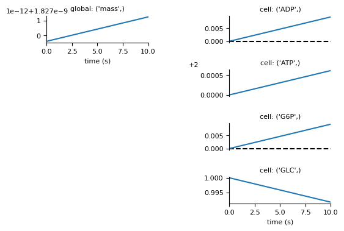

==============================
Getting Started for Developers
==============================

.. note:: This guide is for developers who want to contribute to
   Vivarium Core. If you just want to use Vivarium to build models, see
   the :doc:`getting started guide </getting_started>`.

-------------------------
Download and Installation
-------------------------

This guide assumes that you have access to an administrator or sudoer
account on a macOS or Linux system.

Getting Organized
=================

Creating Enclosing Directory
----------------------------

Create a ``vivarium_work`` folder anywhere you like. But for installing
some third-party software, everything we do will occur inside this
folder.

.. _pypath_dev:

Setting PYTHONPATH
------------------

Vivarium Core needs the root of the repository to be in your
``PYTHONPATH`` environment variable so that Python can find Vivarium
Core. To make this easy to set, we suggest adding this line to your
shell startup file:

.. code-block:: bash

    alias pycd='export PYTHONPATH="$PWD"'

Now when you are about to work on Vivarium Core, navigate to the root of
the Vivarium Core repository (``vivarium_work/vivarium-core``) and run
``pycd`` in your terminal. You will need to do this for each terminal
window you use.

Installing Dependencies
=======================

Below, we list the dependencies Vivarium Core requires, how to check
whether you have them, how to install them, and in some cases, how to
set them up for Vivarium Core.  Make sure you have each of them
installed.

Python 3
--------

Vivarium Core requires Python 3.8, 3.9, or 3.10.

*Check Installation*

.. code-block:: console

    $ python --version
    Python <version>

Make sure you see a version beginning with 3.8, 3.9, or 3.10.

*Install*

Download the latest installer from the `Python download page
<https://www.python.org/downloads/>`_

MongoDB
-------

We use a MongoDB database to store the data collected from running
simulations. This can be a remote server, but for this guide we will
run a MongoDB server locally.

**Note**: MongoDB is only required if you want to store data in MongoDB
or want to run experiments that do so. You don't need MongoDB to work
through this guide.

*Check Installation*

.. code-block:: console

    $ mongod --version
    db version v4.2.3
    ...

Make sure you see a version at least 4.2.

*Install*

If you are on macOS, you can install MongoDB using `Homebrew
<https://brew.sh>`_. You will need to add the MongoDB tap following the
instructions `here <https://github.com/mongodb/homebrew-brew>`_.

If you are on Linux, see the MongoDB documentation's `instructions
<https://docs.mongodb.com/manual/administration/install-on-linux/>`_.

*Setup*

You can get a MongoDB server up and running locally any number of ways.
Here is one:

#. Create a folder ``vivarium_work/mongodb``. This is where MongoDB will
   store the database We store the database here instead of at the
   default location in ``/usr/local/var/mongodb`` to avoid permissions
   issues if you are not running as an administrator.
#. Make a copy of the ``mongod`` configuration file so we can make
   changes:

   .. code-block:: console

      $ cp /usr/local/etc/mongod.conf vivarium_work/mongod.conf

   Note that your configuration file may be somewhere slightly
   different. Check the MongoDB documentation for your system.
#. In ``vivarium_work/mongod.conf`` change the path after ``dbPath:`` to
   point to ``vivarium_work/mongodb``.
#. Create a shell script ``vivarium_work/mongo.sh`` with the following
   content:

   .. code-block:: bash

      #!/bin/bash

      mongod --config mongodb.conf

#. Make the script executable:

   .. code-block:: console

        $ chmod 700 vivarium_work/mongo.sh

   Now you can launch MongoDB by running this script:

   .. code-block:: console

        $ vivarium_work/mongo.sh

.. todo:: Use ``py -m agent.boot --host ip.to.remote.cluster:9092``
    for remote Kafka services

Download and Setup Vivarium Core
================================

Download the Code
-----------------

**Note**: These instructions give you the latest development version of
Vivarium Core. If you want to use the most recent release, which is more
stable, you can instead run ``pip install vivarium-core`` in the
:ref:`python_packages` section below.

The Vivarium Core code is available on `GitHub
<https://github.com/vivarium-collective/vivarium-core>`_. Move into your
``vivarium_work`` directory and clone the repository to
download the code

.. code-block:: console

    $ cd vivarium_work
    $ git clone https://github.com/vivarium-collective/vivarium-core.git

This will create a ``vivarium-core`` folder inside ``vivarium_work``.
All the code for Vivarium Core is inside this ``vivarium-core`` folder.

.. _python_packages:

Installing Python Packages
--------------------------

Above we installed all the non-Python dependencies, but we still have to
install the Python packages Vivarium Core uses.

#. Move into the ``vivarium-core`` folder created when you cloned the
   repository.
#. (optional) Create and activate a virtual environment using ``venv`` or
   ``pyenv virtualenv``, e.g.:

   .. code-block:: console

      $ python3 -m venv venv --prompt "vivarium-core"
      ...
      $ source venv/bin/activate

#. Install packages

   .. code-block:: console

        $ pip install -r requirements.txt

Now you are all set to create models and run simulations with Vivarium
Core!

---------------
Run Simulations
---------------

Some Terminology: Processes and Compartments
============================================

We break our cell models into :term:`processes`. Each process models
part of the cell's function. For example, you might have processes for
metabolism, transcription, and translation. We can combine these
processes into :term:`composites` that model a system with all the
functionality modeled by the included processes. For example, we could
compose transcription and translation to create a fuller gene expression
model.

We store individual processes in ``vivarium-core/vivarium/processes``
and composites of processes in
``vivarium-core/vivarium/composites``. We recommend you use a similar
structure when creating your own processes and composites.

Running Experiments
===================

Running experiments is as easy as executing their files. For example,
this repository comes with an example experiment in
``vivarium-core/vivarium/experiments/glucose_phosphorylation.py``. Try
running it like this:

.. code-block:: console

    $ python vivarium/experiments/glucose_phosphorylation.py

In ``out/experiments/glucose_phosphorylation`` you should see a file
``simulation.png`` that looks like this:

       linearly. The second has 4 plots, the first 3 of which show ADP,
       ATP, and G6P increasing linearly. The last plot shows GLC
       decreasing linearly.
