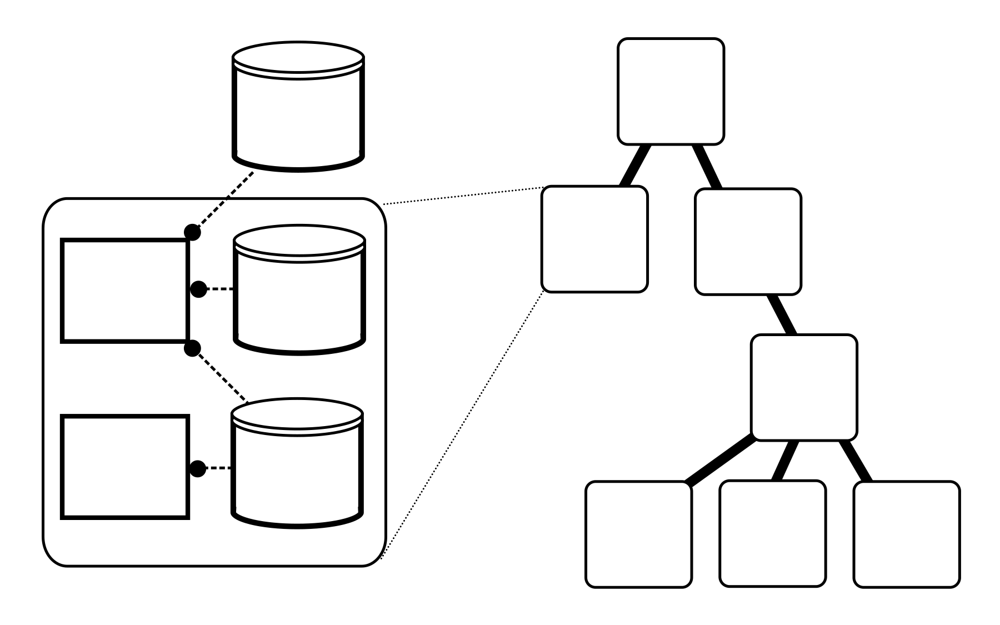

=========
Hierarchy
=========

In Vivarium, we represent the simulation as a tree of :term:`processes`
and :term:`stores` (panel A). The processes and stores are wired
together by topologies to form :term:`compartments` (panel B), which can
then be nested to form a tree called the :term:`hierarchy` (panel C).

.. figure:: ../_static/compartment.png
   :width: 100%
   :align: center
   :alt: A figure with 3 panels lettered A through C. In panel A, we see
       a red database symbol labeled "store" and with the text
       "variable values, units, mass, children, emitters, dividers,
       updaters" within it. Below, a yellow rectangle labeled "process"
       contains the text "variable names, parameters, mechanisms." A
       black line extending from the rectangle is labeled "port". In
       panel B, we see a blue square labeled "compartment". Inside are
       two stores and two processes, with the lower store connected to
       the ports of both processes, and the upper store connected only
       to the top process. A store outside the square labeled "boundary"
       is connected to a port of the upper process. In panel C, 4
       compartments form a tree with one compartment at the top level
       and one at the bottom level. The tree's edges are formed by black
       lines to boundary stores.

   The relationships between stores, processes (panel A), and
   compartments (panel B) in the hierarchy (panel C).

Note that in panel C, only the compartments and boundary stores are
shown. The full hierarchy also contains the stores and processes within each
compartment.

.. note::

    Here we have shown a simplified picture where processes are only
    wired to stores in their own compartment or to boundary stores. In
    reality, processes can be wired to any store in the hierarchy, but
    keeping cross-compartment wiring to a minimum can help simplify your
    models.

We recommend using Vivarium compartments to represent spatial regions of
your modeled system that are conceptually distinct. For example, you
might model a cell as a compartment and its environment as another
compartment. This is not a technical requirement though, so you can use
compartments to represent whatever makes sense for your circumstances.

------------------------
Compartment Interactions
------------------------

We model cross-compartment interactions using :term:`boundary stores`
between compartments. For example, the boundary store between a cell and
its environment might track the flux of metabolites between the cell and
environment compartments.

When compartments are nested, these boundary stores also exist between
the inner and the outer compartment. Thus nested compartments form a
tree whose nodes are compartments and whose edges are boundary stores. A
node's parent is its outer compartment, while its children are the
compartments within it.

Since boundary stores can also exist between compartments who share a
parent, you may find it useful to think of compartments and their
boundary stores as a bigraph (not a bipartite graph) where the tree
denotes nesting and all the edges (including those in the tree)
represent boundary stores.

-------------------
Hierarchy Structure
-------------------

In the example below, we print out the full hierarchy as a dictionary.

>>> from vivarium.experiments.glucose_phosphorylation import (
...     glucose_phosphorylation_experiment,
... )
>>> from vivarium.core.engine import Engine
>>> from vivarium.core.composer import Composer
>>> from vivarium.library.pretty import format_dict
>>>
>>>
>>> experiment = glucose_phosphorylation_experiment()
>>> print(format_dict(experiment.state.get_config()))
{
    "cell": {
        "ADP": {
            "_default": 0.0,
            "_emit": true,
            "_updater": "<function update_accumulate>",
            "_value": 0.0
        },
        "ATP": {
            "_default": 2.0,
            "_emit": true,
            "_updater": "<function update_accumulate>",
            "_value": 2.0
        },
        "G6P": {
            "_default": 0.0,
            "_emit": true,
            "_properties": {
                "mw": "1.0 gram / mole"
            },
            "_updater": "<function update_accumulate>",
            "_value": 0.0
        },
        "GLC": {
            "_default": 1.0,
            "_emit": true,
            "_properties": {
                "mw": "1.0 gram / mole"
            },
            "_updater": "<function update_accumulate>",
            "_value": 1.0
        },
        "HK": {
            "_default": 0.1,
            "_properties": {
                "mw": "1.0 gram / mole"
            },
            "_updater": "<function update_accumulate>",
            "_value": 0.1
        }
    },
    "global": {
        "initial_mass": {
            "_default": "0.0 femtogram",
            "_divider": "<function divide_split>",
            "_units": "<Unit('femtogram')>",
            "_updater": "<function update_set>",
            "_value": "0.0 femtogram"
        },
        "mass": {
            "_default": null,
            "_emit": true,
            "_updater": "<function update_set>",
            "_value": "1.826592973891231e-09 femtogram"
        }
    },
    "glucose_phosphorylation": {
        "_default": null,
        "_updater": "<function update_set>",
        "_value": "<vivarium.processes.glucose_phosphorylation.GlucosePhosphorylation object>"
    },
    "injector": {
        "_default": null,
        "_updater": "<function update_set>",
        "_value": "<vivarium.processes.injector.Injector object>"
    },
    "my_deriver": {
        "_default": null,
        "_updater": "<function update_set>",
        "_value": "<vivarium.processes.tree_mass.TreeMass object>"
    }
}

We can represent this hierarchy graphically like this:

       "global", "injector", "glucose_phosphorylation", and
       "my_deriver". The node "cell" has children "ATP", "ADP", "HK",
       "GLC", and "G6P". The node "global" has children "initial_mass"
       and "mass".

Notice that in the dictionary above, each leaf node in the tree is a key
with a value that is a dictionary of :term:`schema keys`.

---------------
Hierarchy Paths
---------------

A hierarchy in Vivarium is like a directory tree on a filesystem. In
line with this analogy, we specify nodes in the hierarchy with paths.
Each path is a tuple of node names (variable names or store names)
relative to some other node. For example, in the topology from the
example above, we used the path ``('cell', )`` to say that the ``cell``
store maps to the injector's ``internal`` :term:`port`. This path was
relative to the compartment root (``root`` in our diagram) as is the
case for all topologies. Thus the path is analogous to ``./cell`` in a
directory.

Special Symbols
===============

Continuing our analogy between hierarchy paths and file paths, the
following symbols have special meanings in hierarchy paths:

* ``..`` refers to a parent node. One example use for this is a division
  process that needs to access the parent (environment) compartment to
  create the daughter cells. In fact, this is what we do in the growth
  and division compartment.
